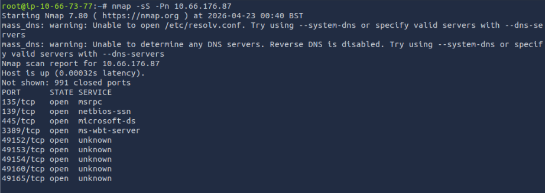
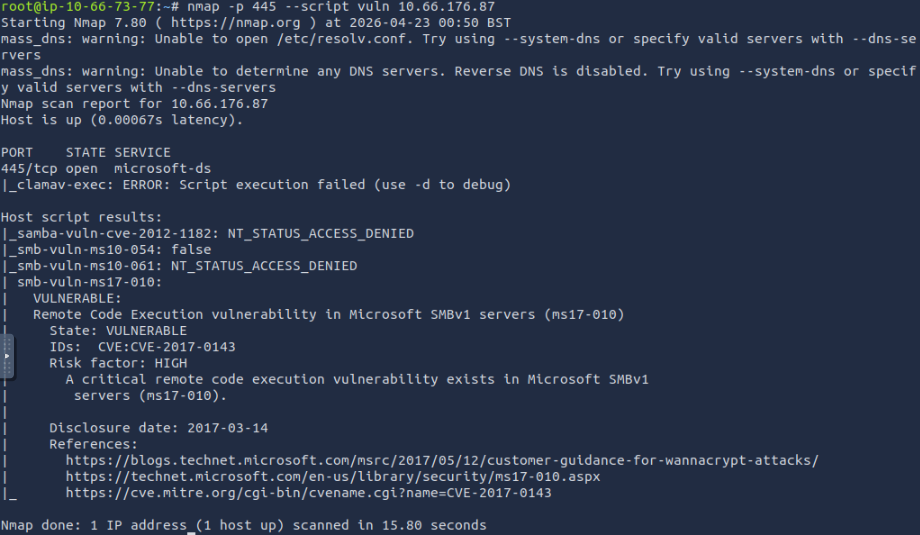
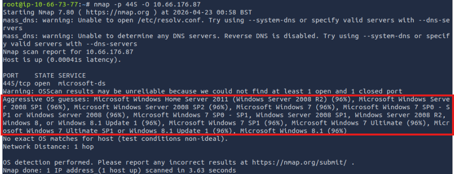

# tryhackme-writeups
Repositorio dedicado a la documentación técnica y resolución de laboratorios en TryHackMe. Este espacio compendia mi progreso en ciberseguridad ofensiva, abarcando desde fundamentos de redes hasta técnicas avanzadas de explotación y escalada de privilegios.

# EternalBlue -- MS17-010
## ¿Que es la vulnerabilidad?
SMBv1 es un protocolo de red antiguo utilizado para compartir archivos y carpetas que carece de mecanismos modernos de seguridad. La vulnerabilidad MS17-010 (EternalBlue) permite a un atacante enviar paquetes especialmente diseñados a un servidor SMBv1, provocando un desbordamiento de memoria que permite la ejecución remota de código (RCE) con privilegios de SYSTEM sin necesidad de credenciales.

## Herramientas usadas
* Nmap: Escaneo de red y detección de vulnerabilidades mediante scripts NSE.
* Metasploit: Framework para la automatización y ejecución del exploit.
* Meterpreter: Payload dinámico para la post-explotación y control del sistema.

## Proceso paso a paso
1. Escaneo de puertos con Nmap
   
2. Identificacion del puerto 445 abierto, confirmo alguna vulnerabilidad
   
3. Verificación de la versión del sistema operativo (Windows 7/2008), que asegura la compatibilidad
    
